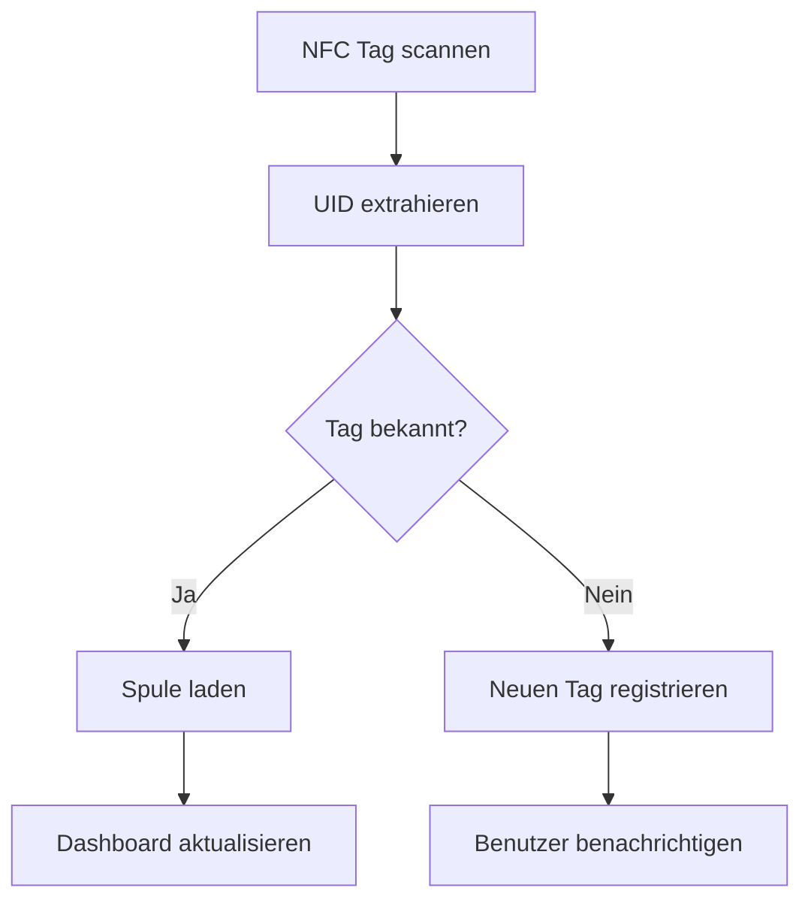

# NFC Integration - Filament Management System

Die NFC-Integration ermöglicht es, physische NFC-Tags mit Filament-Spulen zu verknüpfen und diese über einen Hardware-Scanner zu verwalten.

## 🏷️ Übersicht

### Funktionen
- **Hardware-Scanner**: Python-basierter NFC-Scanner mit automatischer Tag-Erkennung
- **API-Integration**: RESTful Endpoints für Scanner-Kommunikation
- **Spool-Verknüpfung**: Automatische Zuordnung von Tags zu Filament-Spulen
- **Scan-History**: Vollständige Protokollierung aller Tag-Scans
- **Real-time Updates**: Server-Sent Events für Live-Updates

### Komponenten
- `src/Controllers/NfcController.php` - API Controller für NFC-Operationen
- `scripts/nfc-scanner.py` - Hardware-Scanner Service
- `scripts/nfc-scanner.service` - Systemd Service Konfiguration
- `scripts/install-nfc-scanner.sh` - Installations-Script
- `scripts/test-nfc.py` - Test Suite für NFC-Funktionalität

## 🔧 Installation

### Voraussetzungen
- Python 3.8+
- NFC-Hardware (kompatible Reader)
- Systemd (für Service-Installation)
- USB-Zugriff für NFC-Reader

### Hardware Setup
1. **Unterstützte NFC-Reader:**
   - Sony PaSoRi RC-S380
   - ACR122U 
   - PN532-basierte Reader
   - RFID-RC522 Module

2. **Hardware anschließen:**
   ```bash
   # NFC-Reader per USB anschließen
   lsusb | grep -i nfc  # Reader erkennen
   ```

### Software Installation
1. **Installations-Script ausführen:**
   ```bash
   cd scripts/
   chmod +x install-nfc-scanner.sh
   sudo ./install-nfc-scanner.sh
   ```

2. **Scanner konfigurieren:**
   ```bash
   # API URL anpassen
   sudo nano /opt/filament-management/scripts/nfc-scanner.py
   # API_URL = "https://filament.neuhauser.cloud"
   ```

3. **Service starten:**
   ```bash
   sudo systemctl enable nfc-scanner
   sudo systemctl start nfc-scanner
   ```

## 📡 API Endpoints

### POST /api/nfc/scan
Verarbeitet gescannte NFC-Tags
```json
{
  "uid": "A1B2C3D4",
  "type": "NTAG213", 
  "size": 180,
  "data": "Spool Info"
}
```

### POST /api/nfc/register
Registriert neuen NFC-Tag für Spule
```json
{
  "spool_id": 1,
  "uid": "A1B2C3D4",
  "data": "Custom Data"
}
```

### GET /api/nfc/history
Abrufen der Scan-Historie
```json
{
  "scans": [
    {
      "id": 1,
      "uid": "A1B2C3D4",
      "spool_id": 1,
      "scanned_at": "2024-01-15T10:30:00Z"
    }
  ]
}
```

### GET /sse/nfc
Server-Sent Events für Echtzeit-Updates
```javascript
const eventSource = new EventSource('/sse/nfc');
eventSource.onmessage = function(event) {
    const scanData = JSON.parse(event.data);
    console.log('New scan:', scanData);
};
```

## 🔄 Scanner Workflow

### 1. Tag-Scan Prozess


### 2. Spulen-Verknüpfung
1. **Neue Spule erstellen** (über Web-Interface)
2. **NFC-Tag scannen** (über Hardware-Scanner) 
3. **Automatische Verknüpfung** (falls Tag unbekannt)
4. **Bestätigung** (über Dashboard)

## 🧪 Testing

### Test Suite ausführen
```bash
cd scripts/
python3 test-nfc.py
```

### Manuelle Tests
```bash
# Scanner Status prüfen
sudo systemctl status nfc-scanner

# Scanner Logs anzeigen  
sudo journalctl -u nfc-scanner -f

# API testen
curl -X POST http://localhost:8000/api/nfc/scan \
  -H "Content-Type: application/json" \
  -d '{"uid":"TEST1234","type":"NTAG213","data":"Test"}'
```

## 🛠️ Troubleshooting

### Häufige Probleme

#### NFC-Reader nicht erkannt
```bash
# USB-Geräte prüfen
lsusb

# Berechtigungen prüfen
sudo usermod -a -G plugdev nfc-scanner

# Service neu starten
sudo systemctl restart nfc-scanner
```

#### Scanner verbindet nicht
```bash
# Python NFC-Bibliothek testen
python3 -c "import nfc; print(nfc.ContactlessFrontend())"

# Konfiguration prüfen
sudo nano /opt/filament-management/scripts/nfc-scanner.py
```

#### API Fehler
```bash
# API Status prüfen
curl http://localhost:8000/api/status

# Logs anzeigen
sudo tail -f /var/log/nfc-scanner/nfc-scanner.log
```

### Debug-Modus aktivieren
```bash
# Scanner im Debug-Modus starten
sudo -u nfc-scanner python3 /opt/filament-management/scripts/nfc-scanner.py --debug
```

## 🔒 Sicherheit

### Berechtigungen
- Scanner läuft als eigener `nfc-scanner` User
- Minimale System-Berechtigungen
- USB-Zugriff nur für NFC-Reader

### Authentifizierung  
- API erfordert gültige Session
- Rate-Limiting auf Scan-Endpoints
- Scan-Historie nur für authentifizierte User

## 📊 Monitoring

### Service Status
```bash
# Status prüfen
sudo systemctl is-active nfc-scanner

# Performance monitoring
sudo systemctl status nfc-scanner
```

### Logs
```bash
# Service Logs
sudo journalctl -u nfc-scanner --since "1 hour ago"

# Application Logs
sudo tail -f /var/log/nfc-scanner/nfc-scanner.log
```

### Metriken
- Scan-Rate (Scans pro Minute)
- Erfolgsrate (Erkannte vs. Fehlgeschlagene Scans)
- Response-Zeit (Scanner → API)
- Aktive Tags (Registrierte Tag-Anzahl)

## 🚀 Erweiterte Konfiguration

### Custom Scanner Settings
```python
# In nfc-scanner.py anpassen
SCAN_INTERVAL = 1.0  # Sekunden zwischen Scans
MAX_RETRIES = 3      # Wiederholungen bei Fehlern
API_TIMEOUT = 5      # API Request Timeout
```

### Hardware-spezifische Anpassungen
```python
# Für verschiedene NFC-Reader
NFC_DEVICE = 'usb'  # oder 'tty:USB0', 'udp'
NFC_BITRATE = 106   # Kommunikationsgeschwindigkeit
```

## 📚 Entwicklung

### Scanner erweitern
1. `nfc-scanner.py` als Basis nutzen
2. Neue Tag-Handler implementieren
3. API-Endpoints erweitern
4. Tests für neue Funktionen schreiben

### API Integration
```php
// Neuen NFC-Controller erweitern
class CustomNfcController extends NfcController 
{
    public function customScanHandler(): void
    {
        // Custom Logic implementieren
    }
}
```